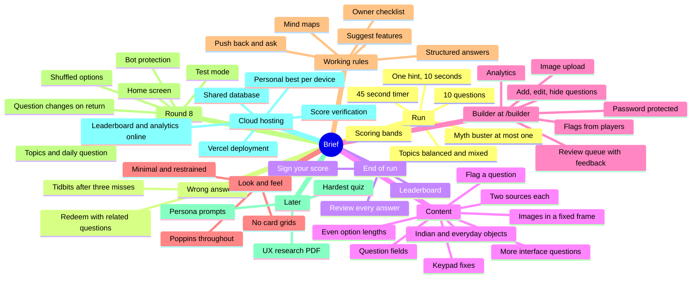

# Brief map

Every instruction given for this project, what became of it, and where it lives in the code. Use it to point at a requirement ("change the redeem share") and go straight to the file. Line numbers follow `file:line`; if one has drifted, search for the function name, and see [code-map.md](code-map.md) for the full layout.

Status: **Done**, **Changed** (done differently from the original ask, with the reason), **Waiting** (needs something from you), **Open** (a decision for you).

## Round 9 requests (20 and 21 September 2026)

| You asked for | Status | Where |
|---|---|---|
| No spoiler control on images: the goal is to make people guess and learn | Done: images always show with the question; the switch is gone | `src/components/QuestionScreen.jsx` |
| Mark the Rapido question as a deduction | Done: a new confidence level, Deduction ("nobody has published the reason; this is the best explanation the evidence supports") | `src/lib/labels.js`, `src/lib/questionRules.js` |
| Hard mode only once 20 people have finished a run | Agreed; to be built before the live site reaches 20 finished runs | `docs/later.md` |
| Present the research PDF | Done, and `npm run pdf` now makes a PDF from any document | `docs/made-that-way-ux-research.pdf`, `scripts/md-to-pdf.js` |
| Host the site | Done: https://madethatway.vercel.app. You made the accounts, repo and storage; I pushed the code and fixed what the live environment showed | `vercel.json`, `server/db.js` |
| (Found going live) | Every function crashed on load because this deployment predated the database connection. The connection is now made on first use, a missing database or password answers with a plain reason instead of crashing, and the database and Blob store are found even when Vercel prefixes their variable names | `server/db.js`, `server/http.js`, `server/auth.js` |

| "That run isn't known here" when signing; any name should show, and a "test" name should go after two minutes | Fixed. My bug: the queue that sends "run started" and "run finished" could jam for good after tidying an empty queue, which answering the daily question, signing and flagging all do. The next run on that page never reached the server. Now fixed and tested on the live site: daily question answered, then two runs in the same page, signed as "test" and as another name, both shown, both gone two minutes later. A run caught by the bug before the fix can't be signed (its timing can't be checked), but every new run works | `src/lib/outbox.js`, `src/lib/outbox.test.js` |

## Round 8 requests (20 September 2026)

| You asked for | Status | Where |
|---|---|---|
| Leaving and coming back should change the question, not restart its clock | Done. Leave at a question you haven't answered and you get a different one at that place when you return, so there's no point looking the answer up | `src/App.jsx:267` (`resumeRun`), `src/lib/run.js:171` (`replacementFor`) |
| Shuffle the answers; they were always in the same place | Done. Every run shuffles each question's four options, and the daily question shuffles per device and day. Answers are still stored in the question's own order, so scoring, flags and analytics are unaffected | `src/lib/shuffle.js`, used in `src/App.jsx:310` |
| Go back or leave from a question, and Restart | Done: "‹ Home" and "Restart" sit quietly in the top bar, and the phone's Back button now goes home instead of leaving the site. No "are you sure?": Restart offers Undo for ten seconds instead | `src/components/TopBar.jsx`, `src/App.jsx:213` (`goHome`), `:248` (`restartRun`) |
| Fewer topics; several had under 5 questions | Done: 8 topics, each with 8 to 18 live questions. Every question carries its topics, so nothing in the code changes when you add more | `src/data/themes.json`, `src/lib/themes.js` |
| Don't make the player think: no question counts in the picker | Done. Pick at least 3 and nothing else is asked. If a choice is small, runs quietly borrow the closest related questions | `src/components/TopicPicker.jsx`, `src/lib/run.js:49` (`questionPool`) |
| Accept all but the last 5 in the queue | Done: 11 accepted (auto-rickshaw, chips packet, side mirror, fan regulator, pencil, plug, jaali, LPG, matka, middle berth, padlock). Still waiting: plane window hole, pressure cooker, rupee marks, safety match, toothpaste marks | `src/data/questions.json`, `src/data/pending-questions.json` |
| A daily question, with the points from round 7, plus the next five days written | Done. One a day for everyone, from a queue you manage; it never repeats and never appears in runs; no timer or points; a streak and an average; days with no question never break a streak; the server checks the answer | `server/routes/daily.js`, `src/components/DailyCard.jsx`, `src/data/daily-questions.json` |
| Recent design questions, using the companies' own reasons | Done: Apple's Liquid Glass, Rapido's "captains turned it down" count, the Swiss passport's UV layers, Duolingo swapping hearts for energy, Google's 2026 icon colours. Rapido never published its reasoning, so that one carries a new "Deduction" confidence label and says so in the answer | `src/data/daily-questions.json`, `SOURCES.md` |
| Test mode in the builder, kept separate, since showing the app to people on your phone is real data | Done: "Play in test mode" opens the quiz with its own device id, name, run and storage; everything it writes is marked as a test. The analytics dashboard has a Players / Test runs switch. The "test" name rule still applies for anyone else's device | `src/lib/testMode.js`, `server/schema.js`, `src/builder/Analytics.jsx` |
| Overview analytics with good UX for an admin | Done: period and Players/Test switches, headline numbers with the change from the period before, activity, funnel, where runs are abandoned, score spread, hardest and easiest questions, topics, when people play, the daily question, and export | `src/builder/Analytics.jsx`, `server/routes/builder/analytics.js` |
| Prefer the alternatives to a CAPTCHA | Done: every run registers with the server when it starts, and saving, flagging and signing all require it; limits per network; strict size and shape checks; names refuse links and swear words; a Players tab to hide a name | `server/routes/events.js`, `server/limits.js`, `src/lib/names.js`, `src/builder/PlayersPanel.jsx` |
| The name on the home screen, changeable, limited to 3 changes | Done. Changing it renames you on every board | `src/components/PlayerName.jsx`, `server/routes/leaderboard.js:186` |
| Images: remove area-codes, keep the rest | Done. The other four are attached; the two watermarked ones are marked as placeholders, so they show locally and never reach the live site | `docs/images-needed.md`, `scripts/optimize-images.js` |
| Show the images in the questions too | Done: the picture sits under the question, in the same frame every time. (A "show after answering" switch was added, then removed in round 9: seeing it is part of working it out) | `src/components/QuestionScreen.jsx:169`, `src/builder/ImageField.jsx` |
| Build as groundwork for a much bigger app | Ongoing rule. This round: routes split into `api/` entry points and `server/` logic, one function for the whole builder, analytics worked out in the database rather than by loading every run, topics and the daily queue as data, and a test flag on every table | `docs/code-map.md` |
| Suggest a "hardest quiz" made of the least-answered-right questions | Open: my answer and a safer shape for it are in `docs/later.md` | |
| The UX research PDF | Content this round, PDF next. Reminder carried in `docs/later.md` | |

## Round 7 requests (19 September 2026, evening)

| You asked for | Status | Where |
|---|---|---|
| Update the mind maps with code details and chat history, then compact | Done | This file, `code-map.md` |
| Sort out the API error | It wasn't the app. My previous turn was cut off by the chat service ("This request would exceed your account's rate limit"), halfway through testing the builder. That testing is picked up and finished this round | |
| There are no topics in the analytics section | Fixed: every topic is listed, even with no plays yet, so the section is never empty. Also shows each topic's live question count | `src/builder/Analytics.jsx` |
| (Found while finishing the testing) | Fixed: the 5 unusable images were still being copied into `public/`, which is published, including a Getty-watermarked one; they're now held back. Selected radio buttons showed a square ring that looked like a checkbox. The review queue said "feedback I haven't acted on" and now says "waiting for a revision" | `scripts/optimize-images.js` (`HELD_BACK`), `src/styles.css:405`, `src/builder/ReviewQueue.jsx` |
| Choose topics: a button on the start screen opens a window of topic pills, pick at least 3, the run uses only those | Done in round 8 | `src/components/TopicPicker.jsx` |
| Restart the quiz or go back from the question screen | Done in round 8 | `src/components/TopBar.jsx`, `src/App.jsx` |
| UX ideas without limits, distilled with frameworks; study trivia and quiz apps; play as a non designer, a beginner and a 10 year veteran and report scores; changes per persona | Content being written; the PDF comes next round (`docs/later.md`) | |
| Overview analytics, beyond per topic and per question, and the data points behind them | Done in round 8 | `src/builder/Analytics.jsx` |
| A daily question that never repeats and never appears in normal runs; a streak for answering daily; show the player's average correct score | Done in round 8 | `server/routes/daily.js`, `src/components/DailyCard.jsx` |

## Round 6 requests (19 September 2026, afternoon): your answers

| You asked for | Status | Where |
|---|---|---|
| 40 images uploaded, mixed formats (AVIF, WEBP, GIF) | Done for 34 of 39 files found. All converted to WebP, max 1600 px wide, GIFs kept animated. 5 not attached: 3 show the wrong subject, 2 are watermarked stock. Every image still needs a credit line | `images/` to `public/images/` via `scripts/optimize-images.js`; list in `docs/images-needed.md` |
| Images in a container of fixed height, so questions don't jump around | Done: every image sits in the same box and is scaled to fit | `src/components/ImageFrame.jsx`, `src/styles.css:759` |
| Pushback 1, password in an env var | Done: `BUILDER_PASSWORD`, never in the code | `api/_auth.js` |
| Pushback 2, use the bundled questions if the database doesn't answer in 3 s; "is there a better way?" | Done, with three additions: the fetch starts when the page opens, not on Start, so it's usually done before anyone taps; the last live bank this device saw is kept and used before the bundled copy; and each run keeps its own copy of its questions, so an edit mid-run can't break it | `src/lib/questionBank.js`, `src/App.jsx:126`, `:154` |
| Pushback 3, "don't understand this" | Explained: no decision needed. Uploaded images need a place to live, and Vercel Blob is one more thing to connect in the dashboard. It's on your checklist | `docs/owner-checklist.md` |
| Pushback 4, feedback read through the live API | Done | `api/builder/questions.js` |
| Pushback 5, content checks at write time | Done: the builder form, the API and the script share one set of rules | `src/lib/questionRules.js` |
| Indian candidates approved, except the dabbawala one ("how would a layman deduce?") | Done: dabbawala dropped, 16 new questions in the review queue | `src/data/pending-questions.json` |
| More everyday objects | Done in the same batch: safety match, chips packet, hexagonal pencil, plane window hole, padlock hole, toothpaste marks, convex side mirror, and more | `src/data/pending-questions.json` |
| Rejected questions are not deleted | Done: kept under "Rejected", can be put back | `src/builder/ReviewQueue.jsx` |
| A checklist of what you need to give me | Done | `docs/owner-checklist.md` |
| Flag a question, "what's wrong with this question?", with better copy and UX if possible | Done. Reasons: "My answer should have counted" (only shown if you got it wrong), "More than one option is right", "Something here is factually wrong", "The source link is broken or doesn't back this up", "The question or options are confusing", "Something else" (needs a note). One flag per question per run; it never changes the score; the builder groups flags by question and records the answer the player chose | `src/lib/flags.js`, `src/components/FlagModal.jsx`, `api/flags.js`, `src/builder/FlagsPanel.jsx` |

## Round 5 requests (19 September 2026, midday): the builder

| You asked for | Status | Where |
|---|---|---|
| Push to a new GitHub repo | Deferred by you ("Git later"). `git init` is done; no commits yet | |
| A builder at `/builder`, with the password you chose | Done. The password lives only in the `BUILDER_PASSWORD` env var, never in the repository | `src/main.jsx:10`, `src/builder/BuilderApp.jsx`, `api/_auth.js` |
| Add, edit and hide questions | Done | `src/builder/QuestionForm.jsx`, `src/builder/QuestionList.jsx`, `api/builder/questions.js` |
| On phones, each question as a card, not a table | Done, including analytics | `src/builder/QuestionList.jsx`, `src/builder/Analytics.jsx:32` |
| Image upload with everything else on a question | Done | `src/builder/ImageField.jsx`, `api/builder/upload.js` |
| The list of images needed, in chat | Done in chat; kept in `docs/images-needed.md` | |
| More everyday-object questions, Indian where possible | Done, see round 6 | `src/data/pending-questions.json` |
| CEED papers and answer keys, with reasons written for each | Waiting on the papers | `docs/owner-checklist.md` |
| Structured answers: what I did, what I propose, pushbacks | Standing rule | Working rules below |
| New questions in their own builder section, 10 to 20 per batch, with Accept, Reject or Feedback; feedback tied to that one question only, and I act on it | Done. Feedback is stored on the question's own row, so it can't apply anywhere else | `src/builder/ReviewQueue.jsx`, `api/_schema.js` |
| Pushbacks on the builder before building | Given; you answered them in round 6 | |

## Round 4 requests (19 September 2026, later still)

| You asked for | Status | Where |
|---|---|---|
| Install Git and Node | Done | Git 2.55, Node 24 LTS, via winget |
| Consider Airtable for storage, mapped to a device ID, with a previous-best-score feature; "tell me if there's a better way" | Discussed first, as asked. Recommendation given: keep Postgres (Airtable's free tier has real rate and row limits that Postgres doesn't; the "look at my data visually" appeal is better served by Neon's own dashboard, which needs no new service or secret). You picked "keep Postgres" | See the discussion in this conversation; database choice unchanged from round 3 |
| Does this solve the API route protection problem? | Answered directly: no, a device id or a different database are both orthogonal to that. What actually helps is the server recomputing the score rather than trusting it, which is the score verification item below | |
| Build the personal-best-per-device feature | Done: one leaderboard row per device, holding its best run | `src/lib/device.js` (`getDeviceId`), `src/lib/leaderboard.js` (`isBetterRun`), `api/leaderboard.js` |
| Build score verification, since you chose to do it now | Done: the leaderboard `POST` no longer carries a score at all. The server looks up the already-stored session for that run id and recomputes the score from its per-question answers, checked against the real question bank. A submission that doesn't check out is rejected | `src/lib/verifySession.js`, called from `api/leaderboard.js` |

**What this doesn't close:** `api/sessions.js` still has no access control, so in principle someone could script a fake session (not just a fake score) with a made-up but internally consistent set of answers, then sign that. Verification checks that the numbers are self-consistent and match the real questions; it can't check that a human actually played. Closing that fully means either an access-controlled write to `/api/sessions`, or having the client sign the session with something the server can check was generated during real play, both meaningfully bigger changes I haven't built and would want to talk through first, the same as this round.

## Round 3 request (19 September 2026, later the same day)

| You asked for | Status | Where |
|---|---|---|
| Host on Vercel's free tier, with all data in the cloud, "not a lot so shouldn't be an issue" | Code done; deployment is a set of account-level steps only you can do (creating GitHub/Vercel accounts, connecting a database), given step by step in the README's "Deploying to Vercel" section | `server/routes/`, `vercel.json`, README.md |

**What "all data in the cloud" became, and why:** the leaderboard and the `/dev` analytics now live in a Postgres database (Vercel's Storage tab, backed by Neon, free tier), reached through two serverless functions. Run-in-progress state (which question you're on, so a reload can resume) stays in the browser: there are no accounts, so a "cloud" copy of one person's half-finished run has nothing to sync against, and moving it would add a device-identity system for no benefit. Say if you want that to change.

**Flagged, then addressed in round 4:** neither API route had any access control, and anyone could post a leaderboard entry directly (not just by playing). Round 4 closed the easy version of this: the leaderboard `POST` no longer carries a score, the server derives it from the stored session instead (see round 4 below). `api/sessions.js` itself still has no access control, which is the remaining gap.

**Database choice:** Vercel Postgres (Neon). It's a couple of clicks in the Vercel dashboard, has a generous free tier for this scale of data, and its query ability suits the `/dev` analytics (grouping, averages) better than a plain key-value store would. Nothing in the app code is tied to Postgres specifically beyond the two `api/*.js` files, so switching database providers later only means rewriting those two files.

## Round 2 requests (19 September 2026)

| # | You asked for | Status | Where |
|---|---|---|---|
| 1 | A mind map of the code and a separate one of your instructions | Done | `docs/code-map.md`, this file |
| 2 | Replace typed redeem: 3 related questions, pick one, answer its 4 options, give back, in a modal | Done. "Give back" was read two ways and both are built: a **Back** link to choose a different question before answering, and **points back** for a right answer (a quarter of the band, as before) | Picking: `src/lib/redeem.js:18`. Flow: `src/App.jsx:157` to `:189`. Window: `src/components/RedeemModal.jsx:18`. Points: `src/lib/scoring.js:4` (`REDEEM_SHARE`) |
| 3 | Options of similar length, wrong ones sometimes 2 to 5 words longer | Done. Right answer was longest in 30 of 40; now never more than 2 words longer, and longest about as often as chance | `src/data/questions.json`; rules at `scripts/content-rules.js:6` to `:11` |
| 4 | A list of the images needed | Waiting on your images | `docs/images-needed.md` |
| 5 | 10 questions per run | Done | `src/lib/scoring.js:3`; topic limits for 10 at `src/lib/run.js:8` |
| 6 | Ask for a name on the score screen | Done, as "Sign your score" | `src/components/EndScreen.jsx:6` (`SignForm`) |
| 7 | Leaderboard, local storage for now | Done, then moved to shared cloud storage in round 3: top 10 on the end screen, top 5 on the start screen | `src/lib/leaderboard.js`, `api/leaderboard.js`, `src/components/Leaderboard.jsx:9`, `src/App.jsx:290` |
| 8 | More questions like the Mac menu bar one | Done: 13 new, mostly interface questions; interface gets 3 or 4 of every 10 | New ids: `context-menu`, `rubber-band-scroll`, `keyboard-hidden-targets`, `button-verbs`, `safari-bottom-bar`, `ctrl-alt-del`, `fuel-door-arrow`, `qr-finder`, `google-blue`, `calculator-keypad`, `phone-zero`, `area-codes`, `crosswalk-buttons`. Weighting: `src/lib/run.js:8` |
| 9 | Fix phone keypad vs calculator, using your two explanations | Changed: split into three questions. Your calculator reason is used (medium confidence). Your rotary reason explains why 0 sits after 9, but not why 1 2 3 is on top, so that stays with Bell Labs' testing | `calculator-keypad`, `phone-keypad`, `phone-zero` in `questions.json`; they share `group: "keypads"` or `"rotary"` so near duplicates never meet in one run (`src/lib/run.js:31`). Notes in `SOURCES.md` |
| 10 | Suggest features and developments | Done in chat, 19 September | Not stored in code |
| 11 | Test as a user and report the UX | Done in chat, 19 September | Not stored in code |

## Original brief

| Requirement | Status | Where |
|---|---|---|
| Run of 20 questions | Changed to 10 in round 2 | `src/lib/scoring.js:3` |
| 45 second limit, shown quietly | Done | `src/lib/scoring.js:1`; timer line `src/components/TopBar.jsx:4`; ticking `src/components/QuestionScreen.jsx:10` |
| Points: 10, 8, 7, 6, 5 by time, 0 after 45 s | Done | `src/lib/scoring.js:8` (`pointBand`) |
| One hint per question, costs 10 seconds | Done | `src/lib/scoring.js:2`, `src/App.jsx:133` |
| Redeem by explaining the reason in your own words, keyword matched | Changed in round 2 to related questions (see above). Keyword matching and `redeemKeywords` were removed | Old code gone; new code `src/lib/redeem.js` |
| Redeem scores a quarter of the band, rounded up | Done, still applies | `src/lib/scoring.js:20` |
| After 3 wrong in a row, a tidbit, with its question 3 later | Done | `src/lib/run.js:145` (`planTidbit`), triggered in `src/App.jsx:204` (`next`) |
| End screen listing every question, tap to read the reasoning | Done; also shows Redeemed | `src/components/EndScreen.jsx:85` |
| Analytics per session and question, viewable at `/dev`, exportable | Done; moved into the builder's Analytics tab in round 5, behind the password (`/dev` is gone) | `src/lib/storage.js:19`, `src/lib/analytics.js:31`, `src/builder/Analytics.jsx:81` |
| All state in localStorage, one write function for analytics | Changed in round 3: analytics and the leaderboard moved to a shared Postgres database, since the point of a leaderboard is that everyone sees the same one. Run-in-progress state and the one write function for analytics both stayed exactly as designed, just now pointed at an API instead of localStorage | `src/lib/storage.js:9` (`recordSession`), `api/sessions.js` |
| Question fields: stem, 4 options, hint, explanations, confidence, source, optional image, tidbits | Done; `explanationWrong` is one per option, and `tags` and `group` were added in round 2 | `src/data/questions.json`, checked by `scripts/content-rules.js:26` |
| Never invent or soften a fact; two sources per question | Done | `SOURCES.md` |
| At most one myth buster per run, in about half of runs | Done | `src/lib/run.js:46` |
| Topics balanced, neighbours differ | Done | `src/lib/run.js:46`, `:82` |
| Minimal, restrained look; Poppins everywhere; generous whitespace; no card grids | Done | `src/styles.css:1` tokens, `:21` Poppins |
| No em dashes, no "cognitive load", no "wayfinding" | Done, enforced | `scripts/content-rules.js:13` (`BANNED_TEXT`) |
| React and Vite, plain CSS, no backend | Changed in round 3: you asked to host on Vercel with cloud storage, which needs a backend. Two small serverless functions were added; everything else about the stack is unchanged | `package.json`, `vite.config.js`, `api/` |
| Out of scope: accounts, opinion questions, duplicate filtering, admin UI, LLM redeem | Respected. Leaderboards were out of scope but came in with round 2, local only | |

## Open decisions for you

| Question | Current default | Where to change it |
|---|---|---|
| How many points should a redeem give back? | A quarter of the band (3 of 10) | `src/lib/scoring.js:4` (`REDEEM_SHARE`) |
| Should redeem questions be written specially for each question, or keep drawing related ones from the pool? | Drawn from the pool, ranked by group, tags and topic | `src/lib/redeem.js:5` |
| Should interface questions keep extra weight? | 3 or 4 of every 10 | `src/lib/run.js:8` |
| Should leaderboard names be moderated? | Not yet: names are only length-capped and stripped of control characters. (Reading analytics now needs the builder password; saving a session is still open, which is the remaining way a scripted fake run could reach the board) | `src/lib/leaderboard.js` (`cleanName`), `api/sessions.js` |
| Should flags from one device be rate limited? | One flag per question per run per device, no other limit | `api/flags.js` |

## Working rules

- Push back when something looks wrong, and ask when a decision is genuinely yours.
- Answer in a structure: what I did, what I propose, pushbacks, questions. Talk before building anything with more than one reasonable shape.
- Suggest features and developments alongside the work.
- Node and Git are installed. `npm run dev` runs the app and its API against a local database; `npm test` and `npm run check:content` run the checks.
- Keep this map and `code-map.md` updated when code moves.
- Keep `docs/owner-checklist.md` current with everything only you can supply.
