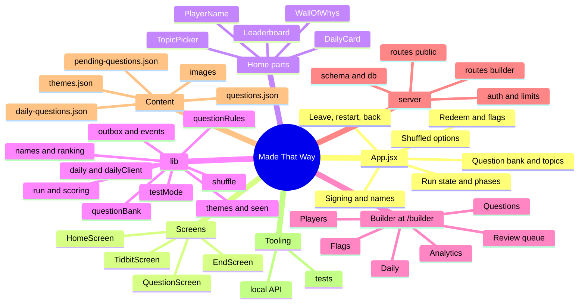

# Code map

Where everything lives, so a change can start from the right file without reading the whole codebase. References are `file:line` plus the function name; if a line number has drifted, search for the name.

Keep this file in step with the code: when you add, move or rename something listed here, update the line.

## App shell

| What | Where |
|---|---|
| Entry point; `/builder` loads the builder lazily. Test mode is switched on here | `src/main.jsx:11` (`initTestMode`), `:14` (`isBuilderRoute`) |
| Run shape, bumped when state changes shape | `src/App.jsx:32` (`RUN_VERSION`, now 4), `:57` (`createRun`) |
| A run keeps its own copy of its questions, the topics it was built from, and the order each question's options are shown in | `src/App.jsx:57` (`createRun`) |
| Resume a saved run. Coming back to an unanswered question swaps it for a fresh one, so leaving can't be used to look the answer up | `src/App.jsx:267` (`resumeRun`), pick at `src/lib/run.js:171` (`replacementFor`) |
| Home, Back and Restart. Play and the end screen each get a history entry, so the phone's Back button goes home | `src/App.jsx:186` (`showHome`), `:204` (`enter`), `:213` (`goHome`), `:248` (`restartRun`, with an Undo toast) |
| Start a run (waits for the live bank, at most 3 s from page load) | `src/App.jsx:226` (`startRun`) |
| Answering: display order in, original order stored | `src/App.jsx:310` (`answer`), `:366` (`answerRedeem`) |
| Hint, redeem, next, tidbits | `src/App.jsx:304` (`takeHint`), `:330` (`openRedeem`), `:383` (`next`), `:462` (`continueFromTidbit`) |
| Sign the leaderboard, change the name | `src/App.jsx:466` (`signScore`), `:482` (`rename`) |
| Flag a question (runs, redeem questions and the daily question) | `src/App.jsx:500` (`openFlag`), `:506` (`submitFlag`) |
| Choose topics | `src/App.jsx:522` (`saveTopics`), window at `src/components/TopicPicker.jsx` |
| Which screen renders, and the test mode banner | `src/App.jsx:537` onwards |

## Screens and components

| What | Where |
|---|---|
| Home: headline, name, Start or Continue, topics, rules, today's question, the wall, the board | `src/components/HomeScreen.jsx:20` |
| Question screen. The question's image sits under the stem, in the same frame every time, before the answer on purpose | `src/components/QuestionScreen.jsx:135`; image at `:169` |
| Timer that ticks and freezes | `src/components/QuestionScreen.jsx:10` (`useElapsed`) |
| Top bar: Home and Restart during a run, position, score, timer line | `src/components/TopBar.jsx:7` |
| Tidbit card | `src/components/TidbitScreen.jsx:3` |
| End screen: score, signing (one tap when the name is known), board, review list | `src/components/EndScreen.jsx:70`; sign form at `:8` |
| Question of the day: answer in place, then the reason, how everyone did, streak and average | `src/components/DailyCard.jsx:27` |
| The wall of whys: a drifting strip of pictures that turn over to show their question | `src/components/WallOfWhys.jsx:12` |
| Name on the board, and changing it (3 changes) | `src/components/PlayerName.jsx:7` |
| Leaderboard with This week and All time | `src/components/Leaderboard.jsx:64`; one list at `:12` (`BoardList`) |
| Topic picker: pills, at least 3 | `src/components/TopicPicker.jsx:7` |
| Dialog shell, explanation window, redeem window, flag window | `src/components/Modal.jsx:7`, `ExplainModal.jsx:5`, `RedeemModal.jsx:18`, `FlagModal.jsx:8` |
| Reasoning block and the fixed-height image frame | `src/components/Explanation.jsx:6`, `ImageFrame.jsx:11`; `showsImage` at `:9` hides placeholders on the live site |
| Undo and other short messages | `src/components/Toast.jsx:5` |

## Logic (`src/lib`)

| What | Where |
|---|---|
| Time limit, hint penalty, run length, redeem share | `src/lib/scoring.js:1` to `:4` |
| The pool a run draws from, topped up quietly when a topic choice is small | `src/lib/run.js:49` (`questionPool`) |
| Pick the 10, preferring questions not seen yet | `src/lib/run.js:70` (`selectQuestions`), `:62` (`freshFirst`) |
| Order them so neighbours differ, tidbits can fire | `src/lib/run.js:139` (`orderQuestions`), `:198` (`planTidbit`) |
| Whole run in one call | `src/lib/run.js:157` (`buildRun`) |
| A replacement question when a player leaves and comes back | `src/lib/run.js:171` (`replacementFor`) |
| Option shuffling: the view a player sees, and mapping back to the stored order | `src/lib/shuffle.js:39` (`viewOf`), `:49` (`toOriginal`), `:50` (`toDisplay`), `:10` (`seededRandom`, for the daily question) |
| Topics: the list, the player's choice, the label above a question | `src/lib/themes.js:17` (`readChosenThemes`), `:28` (`saveChosenThemes`), `:40` (`questionLabel`), `:13` (`MIN_THEMES`) |
| Which questions this device has seen | `src/lib/seen.js:9` (`seenIds`), `:18` (`markSeen`) |
| Names: cleaning, links and swear words, test names, the 3 change limit | `src/lib/names.js:8` (`cleanName`), `:19` (`isTestName`), `:32` (`nameProblem`), `:5` (`NAME_CHANGE_LIMIT`) |
| Daily question maths: the player's day, plausible days, streaks | `src/lib/daily.js:11` (`localDay`), `:20` (`isPlausibleDay`), `:33` (`computeStreak`) |
| Daily question over the network, cached per day | `src/lib/dailyClient.js` (`fetchDaily`, `answerDaily`, `cachedDaily`) |
| Anything that must not be lost offline (run starts, finished runs, events) | `src/lib/outbox.js:63` (`send`), `:32` (`flush`) |
| Activity events | `src/lib/events.js` (`track`, `screenKind`) |
| Test mode: separate id and storage on this device | `src/lib/testMode.js` (`initTestMode`, `isTestMode`, `storageKey`) |
| Question bank: live, cached, or bundled | `src/lib/questionBank.js:27` (`initialBank`), `:40` (`fetchLiveBank`) |
| Question rules, shared by the builder form, the API and the content script | `src/lib/questionRules.js:97` (`checkQuestion`), `:61` (`normalizeQuestion`), `:40` (`slugify`) |
| Leaderboard client: boards, signing, renaming | `src/lib/leaderboard.js` (`readBoards`, `signRun`, `renamePlayer`) |
| Ranking and personal bests (pure, shared with the server) | `src/lib/ranking.js` (`rankEntries`, `isBetterRun`) |
| Score verification, version aware | `src/lib/verifySession.js:21` (`verifySession`) |
| Saving a finished run | `src/lib/storage.js` (`recordSession`) |
| Device id, run storage, tidbit split, CSV export | `src/lib/device.js`, `runStore.js`, `bank.js`, `analytics.js` |

## Builder (`src/builder`, at `/builder`)

| What | Where |
|---|---|
| Shell: sign-in gate, tabs, toast, "Play in test mode", Lock | `src/builder/BuilderApp.jsx:22`; tabs at `:13` |
| Review queue for new questions, oldest first | `src/builder/ReviewQueue.jsx:97`; card at `:34` |
| Questions: search, Live/Hidden, topic filter, hide, export | `src/builder/QuestionList.jsx:32` |
| Add or edit a question: topics, live checks, drafts kept on the device, no overwriting someone else's edit | `src/builder/QuestionForm.jsx:76` |
| Image upload: WebP plus a thumbnail, alt text, credit, "only show after answering" | `src/builder/ImageField.jsx:52` |
| Daily: the queue in order, move and take out, and how each day went | `src/builder/DailyPanel.jsx:13` |
| Flags from players | `src/builder/FlagsPanel.jsx:84` |
| Players: names on the board, hide or show | `src/builder/PlayersPanel.jsx:6` |
| Analytics dashboard: period and Players/Test switch, headline numbers with change, charts, question lists, export | `src/builder/Analytics.jsx:113`; bars at `:57` (`HBars`), `:76` (`VBars`), cards at `:37` (`Kpi`) |
| Token, calls, sign-out on 401 | `src/builder/api.js` |

## Backend (`api/` and `server/`)

`api/` holds one thin file per Vercel function; every route lives in `server/routes`. `/api/builder/<route>` is rewritten to one function (`vercel.json`), so the builder can grow without new functions. Seven functions in total; Vercel's free plan allows twelve.

| What | Where |
|---|---|
| Database client (Neon in the cloud, PGlite locally), connected on first use; a missing database is a 503 with a plain reason, not a crash | `server/db.js` (`connectionString`, `NotConfigured`) |
| Tables, seeding, row shapes. A cold server checks one row and skips setup when nothing changed | `server/schema.js:36` (`ensureSchema`), `:58` (`createTables`), `:245` (`seed`) |
| Builder password and tokens | `server/auth.js` |
| Request helpers, id and day checks, the hashed network key | `server/http.js` |
| Rate limits per network, kept in the database | `server/limits.js` (`hit`, `isBlocked`, `LIMITS`) |
| `GET /api/questions`: live questions and topics | `server/routes/questions.js` |
| `POST /api/events`: page opened, run started (which registers the run), left, restarted, resumed | `server/routes/events.js:31` (`record`) |
| `POST /api/sessions`: save a finished run, checked against its registered run and the real questions | `server/routes/sessions.js` |
| `GET/POST/PATCH /api/leaderboard`: both boards, signing, renaming | `server/routes/leaderboard.js:63` (`boards`), `:110` (`sign`), `:186` (`rename`) |
| `GET/POST /api/daily`: the question of the day, answered and marked here | `server/routes/daily.js:31` (`questionFor`), `:88` (`statsFor`) |
| `POST /api/flags`: a player flags a question | `server/routes/flags.js` |
| Builder routes | `server/routes/builder/`: `login.js`, `questions.js`, `upload.js`, `flags.js`, `daily.js`, `players.js`, `sessions.js`, `analytics.js` |
| Function entry points and the builder dispatcher | `api/*.js`, `api/builder.js` |

**How a leaderboard entry is trusted:** a run registers itself with the server when it starts. Saving it later needs that registration, every question in it must be real, and the timing has to fit the server's own clock. Only then is the run "verified". Signing recomputes the score from the saved answers, against the version of each question the player actually saw (`question_history`). The board shows a random public id per player; device ids never leave the server.

**Test data** (test mode in the builder, or a name with a word starting "test") is marked `is_test` everywhere and kept out of the players' numbers. Test entries show on the board for two minutes.

## Content

| What | Where |
|---|---|
| Live questions and tidbits (the seed, and the fallback if the database is slow) | `src/data/questions.json` |
| New questions waiting for review | `src/data/pending-questions.json` |
| The daily question queue | `src/data/daily-questions.json` |
| Topics players choose from | `src/data/themes.json` |
| Content check for all of them, plus on-screen copy | `scripts/content-rules.js` (`checkContent`, `checkCopy`), run by `scripts/check-content.js` |
| Images: originals in `images/`, published copies and thumbnails in `public/images/`, local-only placeholders in `dev-images/` | `scripts/optimize-images.js` (`npm run images`) |
| Sources for every question | `SOURCES.md` |
| Images still wanted | `docs/images-needed.md` |
| What only the owner can supply | `docs/owner-checklist.md` |
| Agreed but not built yet | `docs/later.md` |

## Styles (`src/styles.css`)

| Section | Line |
|---|---|
| Tokens, layout, top bar, timer | `:1`, `:69` |
| Options, feedback, buttons, inputs | `:164`, `:255` |
| Start and home | `:503` |
| Tidbit, end, signing, board | `:536`, `:547`, `:645`, `:666` |
| Explanation window and image frame | `:721`, `:759` |
| Redeem and flag windows | `:854`, `:941` |
| Builder shell, review queue, question list, form, flags, analytics tables | `:998`, `:1107`, `:1305`, `:1386`, `:1517`, `:1595` |
| Phone layout | `:1716` |
| Round 8: navigation, home, daily, wall, topics, dashboard | `:1880` onwards |

## Tooling

| What | Where |
|---|---|
| Unit tests (`npm test`) | `src/lib/lib.test.js`, `bank.test.js`, `round8.test.js`, `server/auth.test.js`, `server/db.test.js` |
| Runs the `api/` routes inside `npm run dev` against a local Postgres in `.localdb/`, through Vite, so any change to `api/` or `server/` applies on the next request | `tools/local-api.js`, plugged in by `vite.config.js` |
| Local secrets (builder password) | `.env.local`, not committed |
| Preview launch config | `.claude/launch.json` |

## Where state lives

| Key | Holds |
|---|---|
| `madeThatWay.run.v1` | The run in progress, with its questions and option orders |
| `madeThatWay.bank.v2` | The last live bank and topics this device saw |
| `madeThatWay.themes.v1` | The topics this player chose |
| `madeThatWay.seen.v1` | Questions this device has been shown |
| `madeThatWay.daily.v1` | Today's daily question and result |
| `madeThatWay.outbox.v1` | Anything not yet sent to the server |
| `madeThatWay.playerName.v1`, `madeThatWay.deviceId.v1` | This player's name and random device id |
| `madeThatWay.builderToken.v1`, `madeThatWay.builder.draft.*` | Builder sign-in and unsaved question drafts |
| `madeThatWay.testMode` (sessionStorage) | Test mode for this tab; every key above gets a `.test` twin |
| Postgres | `questions`, `question_history`, `themes`, `runs`, `sessions`, `events`, `players`, `signed_runs`, `flags`, `daily_schedule`, `daily_answers`, `rate_limits`, `meta` |
| Vercel Blob (or `.localdb/uploads`) | Images uploaded in the builder |
