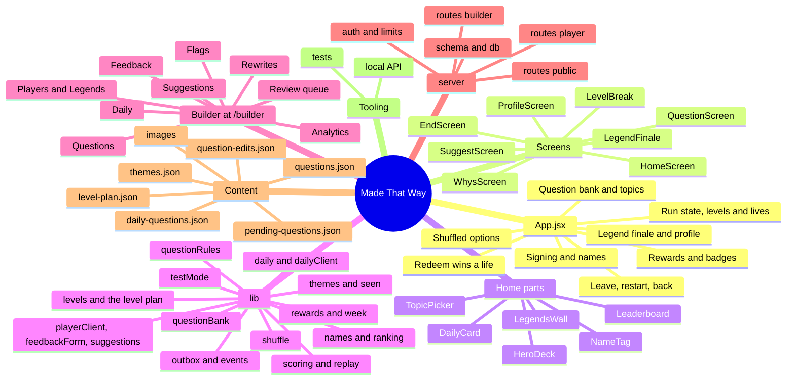

# Code map

Where everything lives, so a change can start from the right file without reading the whole codebase. References are `file:line` plus the function name; if a line number has drifted, search for the name.

Keep this file in step with the code: when you add, move or rename something listed here, update the line.

```mermaid
mindmap
  root((Made That Way))
    App.jsx
      Run state, levels and lives
      Question bank and topics
      Shuffled options
      Leave, restart, back
      Redeem wins a life
      Rewards and badges
      Signing and names
      Legend finale and profile
    Screens
      HomeScreen
      QuestionScreen
      LevelBreak
      EndScreen
      WhysScreen
      LegendFinale
      ProfileScreen
      SuggestScreen
    Home parts
      DailyCard
      HeroDeck
      NameTag
      LegendsWall
      Leaderboard
      TopicPicker
    lib
      scoring and replay
      levels and the level plan
      rewards and week
      shuffle
      themes and seen
      daily and dailyClient
      names and ranking
      questionBank
      questionRules
      outbox and events
      testMode
      playerClient, feedbackForm, suggestions
    Builder at /builder
      Review queue
      Rewrites
      Questions
      Daily
      Flags
      Suggestions
      Players and Legends
      Feedback
      Analytics
    server
      routes public
      routes builder
      routes player
      schema and db
      auth and limits
    Content
      questions.json
      pending-questions.json
      daily-questions.json
      question-edits.json
      themes.json
      level-plan.json
      images
    Tooling
      local API
      tests
```

## App shell

| What | Where |
|---|---|
| Entry point; `/builder` loads the builder lazily. Test mode is switched on here | `src/main.jsx:11` (`initTestMode`), `:14` (`isBuilderRoute`) |
| Run shape, bumped when state changes shape | `src/App.jsx:54` (`RUN_VERSION`, now 5), `:94` (`createRun`) |
| The level plan: how many easy, medium and hard questions each level takes, the last level, milestone badges. Data, so changing the game's length is a file edit | `src/data/level-plan.json`; read by `src/lib/levels.js:55` (`mixFor`), `:227` (`planNeeds`) |
| A run keeps its own copy of its questions, the topics it was built from, and the order each question's options are shown in. It starts with level 1 only; each level is added at the break before it, with that level's tier mix. Clearing the last level ends the run as a Legend | `src/App.jsx:94` (`createRun`), `:487` (`openBreak`), `:474` (`finishRun`) |
| Levels play from picture questions only (text-only ones tired people out) | `src/App.jsx:77` (`levelPool`) |
| Resume a saved run. Coming back to an unanswered question swaps it for a fresh one, so leaving can't be used to look the answer up | `src/App.jsx:357` (`resumeRun`), pick at `src/lib/levels.js:211` (`replacementFor`) |
| Home, Back and Restart. Play, the end screen and the collection each get a history entry, so the phone's Back button goes home | `src/App.jsx:239` (`showHome`, which also refreshes the Legends wall), `:258` (`enter`), `:267` (`goHome`), `:338` (`restartRun`, with an Undo toast) |
| Start a run (waits for the live bank, at most 3 s from page load), optionally with a picked first question; mid-run it offers Undo | `src/App.jsx:315` (`startRun`), `:338` (`restartRun`) |
| Answering: display order in, original order stored; points worked out from the answers so far | `src/App.jsx:398` (`answer`), `:459` (`answerRedeem`, a right one wins the life back) |
| Hint, redeem, next, the level break, finishing | `src/App.jsx:392` (`takeHint`), `:415` (`openRedeem`), `:542` (`next`), `:487` (`openBreak`), `:576` (`continueLevel`), `:580` (`finishAtBreak`), `:474` (`finishRun`) |
| Rewards during play: whys uncovered, badges, the streak badge from the daily card | `src/App.jsx:295` (`uncovered`), `:282` (`grant`), `:304` (`onStreak`); milestone badges (bronze at level 5) in `openBreak` |
| Sign the leaderboard, sign the Legends wall, change the name | `src/App.jsx:584` (`signScore`), `:600` (`putOnLegends`), `:616` (`rename`) |
| Flag a question (runs, redeem questions and the daily question) | `src/App.jsx:634` (`openFlag`), `:640` (`submitFlag`) |
| Choose topics (they come first in levels) | `src/App.jsx:656` (`saveTopics`), window at `src/components/TopicPicker.jsx` |
| Which screen renders (home, play, break, legend, end, collection, profile, suggest), the rename and feedback windows, and the test mode banner | `src/App.jsx:680` onwards; legend at `:739`, profile at `:759`, suggest at `:773` |

## Screens and components

| What | Where |
|---|---|
| Home: the picture deck, the headline, "Let's start" (or carry on), and a progress line for returning players; then today's question, how it works in pictures, the Legends wall, the board and topics | `src/components/HomeScreen.jsx:117`; progress at `:29`, how it works at `:58` |
| Question screen. The image sits under the stem, in the same frame every time, before the answer on purpose. After answering: the two answers that matter lead (the others shrink to a line), then the result and the short reason; the next step sits in one action bar, pinned to the bottom on a phone. The hint only shows when the question has one | `src/components/QuestionScreen.jsx:120`; result at `:32`, reason at `:63`, action bar at `:89`, scroll into view at `:147` |
| Top bar: Home and Restart during a run, then the level, hearts, combo and score, and a segment per question in the level | `src/components/TopBar.jsx:13` |
| Hearts that drop and refill; a number that counts up; the level-up burst | `src/components/Hearts.jsx:15`, `CountUp.jsx`, `Burst.jsx` |
| Level break: score so far, what the level earned, a medal at a milestone, a clue for the next level, carry on or stop | `src/components/LevelBreak.jsx:14` |
| The Legend finale after the last level: lights, a trophy made of the run's pictures, then signing the wall by drawing, the stamped card, the wall, and the feedback form | `src/components/LegendFinale.jsx:58`; trophy at `:14` |
| Drawing a signature (stored as a small SVG path), and showing one | `src/components/SignaturePad.jsx:10`, `:114` (`Signature`) |
| The Legends wall: signature, name, score and time for everyone who cleared every level | `src/components/LegendsWall.jsx:6` |
| Profile: best level and score, share right, per-level bars, last runs, badges, suggestions sent; never the questions | `src/components/ProfileScreen.jsx:20` |
| Suggest a question: a one-line idea or a whole question with a picture, then a name or "Be mysterious" | `src/components/SuggestScreen.jsx:10` |
| Feedback form: three star ratings, what to add more of, tell a friend, a note | `src/components/FeedbackForm.jsx:35`; the questions as data in `src/lib/feedbackForm.js` |
| End screen: score, levels, whys and badges earned, Play again, signing (one tap when the name is known), this week's board, review by level | `src/components/EndScreen.jsx:71`; sign form at `:11` |
| Collection: badges and every why uncovered, each opening its reasoning | `src/components/WhysScreen.jsx:7` |
| Question of the day: answer in place, then the reason, how everyone did, streak and average; on a later visit the same day it folds to one line | `src/components/DailyCard.jsx:26` |
| The hero deck (GSAP): 24 picture cards, unseen first, piled like prints. Drag or flick the top card either way (or press the arrow keys) and it slides out, then tucks in behind the pile as the next comes forward; no counter or buttons, one hint line; a deal from below on arrival, a nudge if nobody touches it, a tilt and glare under the mouse. Tap (or Enter) flips the card in 3D and grows it into a window with the picture, its question, "Play this one" and "Another one"; it flips back into the pile on close. Less motion: no throws or flips, just quick fades | `src/components/HeroDeck.jsx:189`; the pile's places at `:20` (`SLOTS`), sending a card to the back at `:263` (`throwTop`), the drag at `:345`, the flip window at `:55` (`FlipDialog`) |
| "Call me <name>" top right: the name opens the profile, the pencil renames (3 changes). Everyone starts with a random name like fuzzyheron42 | `src/components/NameTag.jsx:8`, `:24` (`RenameModal`); names from `src/lib/names.js:57` (`randomName`), kept by `src/lib/leaderboard.js:98` (`placeholderName`) |
| This week's board, with when it resets | `src/components/Leaderboard.jsx` (`Leaderboard`, `BoardList`) |
| Topic picker: pills, at least 3 | `src/components/TopicPicker.jsx:7` |
| Dialog shell, explanation window, redeem window, flag window | `src/components/Modal.jsx:7`, `ExplainModal.jsx:5`, `RedeemModal.jsx:18`, `FlagModal.jsx:8` |
| Reasoning block and the fixed-height image frame | `src/components/Explanation.jsx:6`, `ImageFrame.jsx:11`; `showsImage` at `:9` hides placeholders on the live site |
| Undo and other short messages | `src/components/Toast.jsx:5` |

## Logic (`src/lib`)

| What | Where |
|---|---|
| Level size, lives, points: the level multiplier, the combo, a hint halving them | `src/lib/scoring.js:10` to `:15`, `:32` (`pointsFor`) |
| Everything that follows from a run's answers (points, lives, combo, levels cleared), shared by the quiz and the server | `src/lib/scoring.js:43` (`replay`) |
| Build the next level: unseen first, then chosen topics, then easiest; no near duplicates; two a topic at most; neighbours differ; a clue for one of its questions; a picked question (`firstId`) opens it | `src/lib/levels.js:129` (`buildLevel`), `:68` (`openQuestions`). Each level fills its easy, medium and hard slots from `mixFor`, borrowing from the nearest tier when one runs out |
| How easy a question has proved, and the share who get it right | `src/lib/levels.js:29` (`easeOf`), `:36` (`percentRight`); a tier that doesn't match how players do is flagged (never changed) by `:242` (`tierMismatch`) |
| A replacement question when a player leaves and comes back | `src/lib/levels.js:211` (`replacementFor`) |
| Redeem choices: most related first, keeping picture questions for the levels | `src/lib/redeem.js:27` (`pickRedeemQuestions`); hard ones are left out while there's enough else |
| Rewards on this device: whys uncovered, badges, best run | `src/lib/rewards.js:16` (`BADGES`, with bronze, silver and legend), `:28` (`availableBadges`, only those the plan's last level allows), `:67` (`uncover`), `:81` (`award`) |
| The weekly board's week (Monday, India time) | `src/lib/week.js:9` (`weekStart`), `:19` (`resetWords`) |
| The short reason after an answer | `src/lib/text.js` (`firstSentence`) |
| Option shuffling: the view a player sees, and mapping back to the stored order | `src/lib/shuffle.js:39` (`viewOf`), `:49` (`toOriginal`), `:50` (`toDisplay`), `:10` (`seededRandom`, for the daily question) |
| Topics: the list, the player's choice, the label above a question | `src/lib/themes.js:17` (`readChosenThemes`), `:28` (`saveChosenThemes`), `:40` (`questionLabel`), `:13` (`MIN_THEMES`) |
| Which questions this device has seen | `src/lib/seen.js:9` (`seenIds`), `:18` (`markSeen`) |
| Names: cleaning, links and swear words, test names, the 3 change limit | `src/lib/names.js:8` (`cleanName`), `:19` (`isTestName`), `:32` (`nameProblem`), `:5` (`NAME_CHANGE_LIMIT`), `:57` (`randomName`) |
| Daily question maths: the player's day, plausible days, streaks | `src/lib/daily.js:11` (`localDay`), `:20` (`isPlausibleDay`), `:33` (`computeStreak`) |
| Daily question over the network, cached per day | `src/lib/dailyClient.js` (`fetchDaily`, `answerDaily`, `cachedDaily`) |
| Anything that must not be lost offline (run starts, finished runs, events), sent in order | `src/lib/outbox.js` (`send`, `flush`, `drain`); tested in `outbox.test.js` |
| Activity events | `src/lib/events.js` (`track`, `screenKind`) |
| Test mode: separate id and storage on this device | `src/lib/testMode.js` (`initTestMode`, `isTestMode`, `storageKey`) |
| Question bank: live, cached, or bundled | `src/lib/questionBank.js:27` (`initialBank`), `:40` (`fetchLiveBank`) |
| Question rules, shared by the builder form, the API and the content script | `src/lib/questionRules.js:122` (`checkQuestion`), `:72` (`normalizeQuestion`), `:51` (`slugify`); tiers at `:18` (`DIFFICULTIES`), length limits at `:22` |
| Leaderboard client: boards, signing, renaming | `src/lib/leaderboard.js` (`readBoards`, `signRun`, `renamePlayer`) |
| Player client: profile, Legends wall, signing it, feedback, suggestions and their pictures | `src/lib/playerClient.js:34` onwards, `:42` (`signLegend`) |
| Suggestion and feedback checks, shared by the quiz and the server | `src/lib/suggestions.js:16` (`cleanSuggestion`), `src/lib/feedbackForm.js:31` (`cleanFeedback`) |
| Shrinking a picture to WebP plus a thumbnail before upload; matching a file name to a question id | `src/lib/imagePrep.js:33` (`prepareImage`), `:50` (`idFromFilename`) |
| Times and dates in words | `src/lib/format.js:4` (`duration`), `:15` (`shortDate`) |
| Ranking and personal bests (pure, shared with the server) | `src/lib/ranking.js` (`rankEntries`, `isBetterRun`) |
| Score verification, version aware, redeems included | `src/lib/verifySession.js:27` (`verifySession`), `:76` (`sessionQuestionIds`) |
| Saving a finished run | `src/lib/storage.js` (`recordSession`) |
| Device id, run storage, tidbit split, CSV export | `src/lib/device.js`, `runStore.js`, `bank.js`, `analytics.js` |

## Builder (`src/builder`, at `/builder`)

| What | Where |
|---|---|
| Shell: sign-in gate, tabs, toast, "Play in test mode", Lock. Making a question from a suggestion, or saving one opened from a rewrite, marks that done | `src/builder/BuilderApp.jsx:32`; tabs at `:17` |
| Review queue for new questions, oldest first | `src/builder/ReviewQueue.jsx:97`; card at `:34` |
| Rewrites: changes Claude proposes to existing questions, now and proposed side by side (question, each option, any explanation), easy ones first; use it, edit it first, or keep it as it is | `src/builder/RewritesPanel.jsx:124`; `:15` (`changedParts`) |
| Questions: how each tier stands against the level plan, pictures in bulk (file name = question id), Easy/Medium/Hard tabs newest first, tier switch per question, mismatch flags, search, Live/Hidden, topic filter, hide, export | `src/builder/QuestionList.jsx:124`; plan at `:44` (`PlanHealth`), bulk at `:70` (`BulkPictures`) |
| Add or edit a question: difficulty, topics, live checks and word counts, drafts kept on the device, no overwriting someone else's edit; can start from a suggestion | `src/builder/QuestionForm.jsx:83` |
| Image upload: WebP plus a thumbnail, alt text, credit, "only show after answering" | `src/builder/ImageField.jsx:52` |
| Daily: the queue in order, move and take out, and how each day went | `src/builder/DailyPanel.jsx:13` |
| Flags from players | `src/builder/FlagsPanel.jsx:84` |
| Players: names on the board, hide or show; the Legends wall with signatures below, hide or show | `src/builder/PlayersPanel.jsx:7`, `src/builder/LegendsReview.jsx` |
| Suggestions from players: make one a question (the form opens filled in and credited), mark used, or not this one | `src/builder/SuggestionsPanel.jsx:29`; `:13` (`suggestionToPrefill`) |
| Feedback: averages, what players want more of, tell a friend, every answer | `src/builder/FeedbackPanel.jsx:9` |
| Analytics dashboard: period and Players/Test switch, headline numbers with change, charts, question lists, export | `src/builder/Analytics.jsx:113`; bars at `:57` (`HBars`), `:76` (`VBars`), cards at `:37` (`Kpi`) |
| Token, calls, sign-out on 401 | `src/builder/api.js` |

## Backend (`api/` and `server/`)

`api/` holds one thin file per Vercel function; every route lives in `server/routes`. `/api/builder/<route>` is rewritten to one function (`vercel.json`), so the builder can grow without new functions; `/api/player/<route>` does the same for the player's own routes (`api/player.js`). Eight functions in total; Vercel's free plan allows twelve.

| What | Where |
|---|---|
| Database client (Neon in the cloud, PGlite locally), connected on first use; a missing database is a 503 with a plain reason, not a crash | `server/db.js` (`connectionString`, `NotConfigured`) |
| Tables, seeding, row shapes. A cold server checks one row and skips setup when nothing changed | `server/schema.js:47` (`ensureSchema`), `:69` (`createTables`), `:352` (`seed`); `question_edits` at `:114`, seeded at `:394`; `question_stats` at `:253`, daily answers folded in once at `:287`; `legends`, `feedback`, `suggestions` at `:300`, `:316`, `:329`; pictures from `site-images.json` attached at `:418` |
| Builder password and tokens | `server/auth.js` |
| Request helpers, id and day checks, the hashed network key | `server/http.js` |
| Rate limits per network, kept in the database | `server/limits.js` (`hit`, `isBlocked`, `LIMITS`) |
| A run the server trusts: registered, saved with plausible timing, answers replayed. Shared by the leaderboard and the Legends wall | `server/runs.js:29` (`checkedRun`), `:12` (`versionsFor`) |
| Storing an image in Vercel Blob (or `.localdb/uploads` locally), with a plain reason when it's refused | `server/blob.js:25` (`storeImage`) |
| `GET /api/questions`: live questions, plus daily questions whose day has passed everywhere, with how often each is answered right, and topics | `server/routes/questions.js` |
| `POST /api/events`: page opened, run started (which registers the run), left, restarted, resumed, level cleared | `server/routes/events.js` (`record`) |
| `POST /api/sessions`: save a finished run, checked against its registered run and the real questions; adds its answers to `question_stats` | `server/routes/sessions.js` |
| `GET/POST/PATCH /api/leaderboard`: this week's board and the player's private best, signing, renaming | `server/routes/leaderboard.js:64` (`board`), `:99` (`sign`), `:163` (`rename`) |
| `GET/POST /api/daily`: the question of the day, answered and marked here; a real first answer also counts in `question_stats` | `server/routes/daily.js:34` (`questionFor`), `:91` (`statsFor`) |
| `POST /api/flags`: a player flags a question | `server/routes/flags.js` |
| `GET/POST /api/player/legends`: the Legends wall; signing it needs a checked run that cleared the plan's last level | `server/routes/player/legends.js:44` (`list`), `:57` (`add`) |
| `GET /api/player/profile`: one device's totals, levels and last runs, worked out in the database | `server/routes/player/profile.js` |
| `POST /api/player/feedback`, `/suggest`, `/upload`: the feedback form, a suggested question, its picture | `server/routes/player/` |
| Builder routes | `server/routes/builder/`: `login.js`, `questions.js` (also `setImage`, `setDifficulty`, and `applyEdit` / `closeEdit` for proposed rewrites at `:199`), `upload.js`, `flags.js`, `daily.js`, `players.js`, `sessions.js`, `analytics.js`, `legends.js`, `feedback.js`, `suggestions.js` |
| Function entry points and the two dispatchers | `api/*.js`, `api/builder.js`, `api/player.js` |

**How a leaderboard entry is trusted:** a run registers itself with the server when it starts. Saving it later needs that registration, every question in it must be real, and the timing has to fit the server's own clock (and allow at least 2 seconds an answer). Only then is the run "verified". Signing replays the saved answers with the quiz's own scoring (`replay`): points, combos, lives, and every redeem checked against its real question, against the version of each question the player actually saw (`question_history`). The board shows a random public id per player; device ids never leave the server.

**Test data** (test mode in the builder, or a name with a word starting "test") is marked `is_test` everywhere and kept out of the players' numbers. Test entries show on the board for two minutes.

## Content

| What | Where |
|---|---|
| Live questions and tidbits (the seed, and the fallback if the database is slow) | `src/data/questions.json` |
| New questions waiting for review | `src/data/pending-questions.json` |
| The daily question queue (after its day, each joins the run pool) | `src/data/daily-questions.json` |
| Changes proposed to questions already in the database (only the listed fields change); they wait in the builder's Rewrites tab and are checked by `npm run check:content` as the question would read after | `src/data/question-edits.json` |
| Pictures shipped with the site for questions already in the database: attached on the server's next start, never replacing a picture set in the builder; checked by `npm run check:content` | `src/data/site-images.json` |
| What makes a good question: the aha recipe, the audit of live questions, ideas for the next batch | `docs/question-strategy.md` |
| Topics players choose from | `src/data/themes.json` |
| Level plan: tiers per level, last level, milestones | `src/data/level-plan.json` |
| Content check for all of them, plus on-screen copy, every shipped picture file, and each proposed edit as the question would read after it | `scripts/content-rules.js` (`checkContent`, `checkCopy`), run by `scripts/check-content.js` |
| Images: originals in `images/`, published copies and thumbnails in `public/images/`, local-only placeholders in `dev-images/` | `scripts/optimize-images.js` (`npm run images`) |
| Sources for every question | `SOURCES.md` |
| Images still wanted: file names, what each should show, credits owed | `images/IMAGES-NEEDED.md` (kept in git; everything else in `images/` is not) |
| What only the owner can supply | `docs/owner-checklist.md` |
| Agreed but not built yet | `docs/later.md` |

## Styles (`src/styles.css`)

| Section | Line |
|---|---|
| Tokens, layout, top bar | `:1`, `:72` |
| Options, feedback, buttons, inputs | `:152`, `:243` |
| Start and home | `:495` |
| End, signing, board | `:528`, `:626`, `:647` |
| Explanation window and image frame | `:702`, `:740` |
| Redeem and flag windows | `:835`, `:922` |
| Builder shell, review queue, question list, form, flags, analytics tables | `:979`, `:1088`, `:1286`, `:1367`, `:1498`, `:1576` |
| Phone layout | `:1697` |
| Round 8: navigation, home, daily, topics, dashboard | `:1842` onwards |
| V2: top bar during play, hearts, answering, the reason, level break, burst, end, home, collection, less motion | `:2656` onwards |
| Round 12: name tag, home hero, folded daily, how it works, Legends, profile, suggest, feedback, signature pad, medal, the finale | `:3432` onwards; finale at `:4213` |
| Builder round 12: plan health, bulk pictures, tier tabs, suggestions, feedback, legends review | `:4744` |
| Builder rewrites: now and proposed | `:4989` |
| The hero deck, and the card flipped open | `:4885`, `:5060` |

## Tooling

| What | Where |
|---|---|
| Unit tests (`npm test`) | `src/lib/v2.test.js` (scoring, levels and tier mixes, verification, rewards, the week, starting names), `lib.test.js`, `bank.test.js`, `round8.test.js`, `outbox.test.js`, `server/auth.test.js`, `server/db.test.js` |
| Runs the `api/` routes inside `npm run dev` against a local Postgres in `.localdb/`, through Vite, so any change to `api/` or `server/` applies on the next request | `tools/local-api.js`, plugged in by `vite.config.js` |
| Local secrets (builder password) | `.env.local`, not committed |
| Preview launch config | `.claude/launch.json` |

## Where state lives

| Key | Holds |
|---|---|
| `madeThatWay.run.v1` | The run in progress, with its questions and option orders |
| `madeThatWay.bank.v2` | The last live bank and topics this device saw |
| `madeThatWay.themes.v1` | The topics this player chose |
| `madeThatWay.seen.v1` | Questions this device has been shown |
| `madeThatWay.whys.v1`, `madeThatWay.badges.v1`, `madeThatWay.best.v1` | Whys uncovered, badges earned and the best run, on this device |
| `madeThatWay.daily.v1` | Today's daily question and result |
| `madeThatWay.outbox.v1` | Anything not yet sent to the server |
| `madeThatWay.playerName.v1`, `madeThatWay.placeholderName.v1`, `madeThatWay.deviceId.v1` | This player's chosen name, the random name they start with, and their random device id |
| `madeThatWay.builderToken.v1`, `madeThatWay.builder.draft.*` | Builder sign-in and unsaved question drafts |
| `madeThatWay.testMode` (sessionStorage) | Test mode for this tab; every key above gets a `.test` twin |
| Postgres | `questions`, `question_history`, `question_edits`, `question_stats`, `themes`, `runs`, `sessions`, `events`, `players`, `signed_runs`, `flags`, `daily_schedule`, `daily_answers`, `legends`, `feedback`, `suggestions`, `rate_limits`, `meta` |
| Vercel Blob (or `.localdb/uploads`) | Images uploaded in the builder (`questions/`) and pictures players send with a suggestion (`suggestions/`) |
